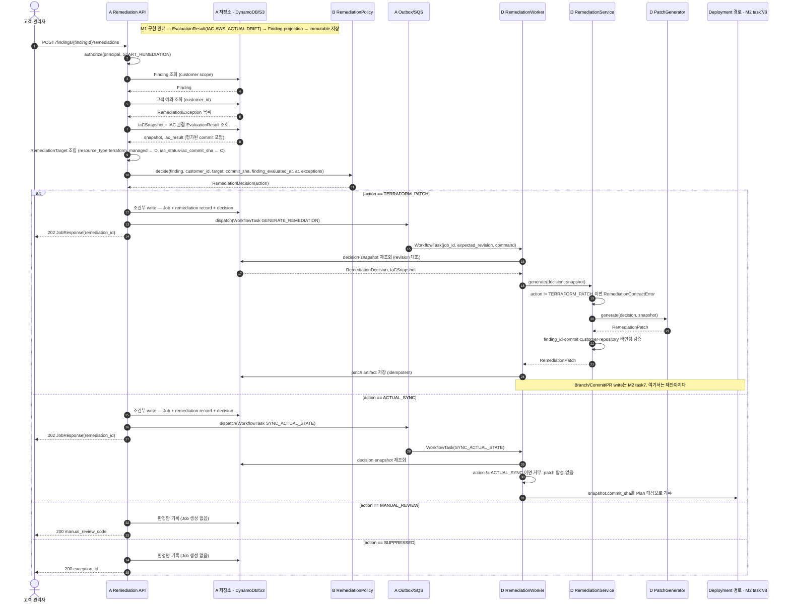

# ADR-0018 (초안): M2 Remediation 정책 게이트 소비 계약 — 호출은 A, 강제는 D

> **상태: 제안(Proposed).** 이 PR이 A·C·D의 검토·합의 요청이다. 합의 결과를 반영한 뒤
> 상태를 Accepted로 바꾸고, 미결 항목은 아래 Open decision에 남긴다.
>
> **목적:** B의 `RemediationPolicy.decide()`(PR #24), D의 Patch 생성(PR #21), A의 Remediation
> API(PR #23)를 잇는 **소비 계약**을 누가·무엇을·어떤 순서로 호출하는지까지 고정한다.
> 루트 `PROGRESS.md` Blocked 항목 "M2에서 정책 판정과 Patch 생성을 잇는 계약이 없다"의
> Final record 후보다.
>
> **이 문서의 범위:** 결정(D1~D7)과 오케스트레이션 명세까지다. 합의 회의 안건, 열린 PR 처리
> 방침, 역할별 구현 체크리스트와 테스트 목록은 이 PR 본문에 있다 (AGENTS.md: ADR은 장기 기술
> 결정, 팀 차단 사항은 `PROGRESS.md`, Task 상세는 각자의 `.ai/`). 이 ADR이 답하는 Blocked 항목
> 자체는 PR #24가 `PROGRESS.md`에 추가한다.
>
> **관련 PR:** #21(D, patch generator) / #23(A·C, remediation context·readiness·API) /
> #24(B, remediation policy)
> **Producer:** B(`RemediationPolicy`) · **Consumer:** A(Remediation API), C(Context), D(Patch/Sync)

---

## Context

### 확인된 코드 사실

각 PR 브랜치에서 직접 읽어 확인했다 (2026-09-01). **세 PR 모두 아직 `dev`에 merge되지 않았다** —
`dev`에 있는 것은 `apps/backend/remediation/service.py`뿐이다. B 항목은
`feature/m2-policy-remediation-scope`의 working tree 기준이며 커밋 `ae4c823` 이후의 보강
(`RemediationTarget`의 `rule_id`/`rule_version`/`iac_commit_sha`, 예외의 승인·만료 분리)을
포함한다.

| 역할 | 위치 | 지금 하는 일 |
| --- | --- | --- |
| B (#24) | `apps/backend/policy/remediation.py` | `RemediationPolicy.decide(finding, *, customer_id, target, commit_sha, finding_evaluated_at, at, exceptions) -> RemediationDecision`. 아무것도 영속화하지 않고 GitHub·AWS·Terraform을 건드리지 않는다 |
| B (#24) | `packages/contracts/remediation_policy.py` | `RemediationAction`(`TERRAFORM_PATCH`/`ACTUAL_SYNC`/`MANUAL_REVIEW`/`SUPPRESSED`), `RemediationDecision`, `RemediationTarget`(`resource_id`, `resource_type`, `rule_id`, `rule_version`, `terraform_managed`, `iac_status?`, `iac_perspective?`, `iac_commit_sha?`), `RemediationException`, `RemediationEligibility`, `ManualReviewCode` |
| D (#21) | `apps/backend/remediation/service.py` | `RemediationService.generate(*, finding_id, snapshot) -> RemediationPatch`. patch가 finding·snapshot·customer·repository에 묶였는지 **검증만** 한다. 판정을 묻지 않는다 |
| D (#21) | `apps/backend/remediation/generator.py` | `FixturePatchGenerator.generate(*, finding_id, snapshot)`. `PatchGenerator` Protocol 구현체 |
| A (#23) | `apps/backend/api/remediations.py` | `RemediationApiService.create_remediation(principal, finding_id)`. `authorize(START_REMEDIATION)` → `RemediationContextReader.get_context(customer_id, finding_id)` → `job_type="REMEDIATION"`, `JobCurrentStep.GENERATE_REMEDIATION` Job 생성 → `WorkflowCommand.GENERATE_REMEDIATION` outbox dispatch |
| C (#23) | `apps/backend/remediation/context.py` | `build_remediation_context(finding, snapshot, iac_result, actual_result) -> RemediationContext`. `RemediationStrategy`(`PATCH_IAC`/`SYNC_CURRENT_IAC`/`MANUAL_REVIEW`)를 IaC·Actual status로 파생 |
| C (#23) | `apps/backend/remediation/readiness.py` | `evaluate_deployment_readiness(context, plan_input) -> DeploymentReadiness` |
| — | 없음 | `WorkflowCommand.GENERATE_REMEDIATION`을 소비하는 **Worker가 존재하지 않는다**. `apps/backend/assessment/worker.py`만 있다 |

### 문제 1 — 판정 게이트가 어디에도 없다

`RemediationApiService.create_remediation()`은 `decide()`를 호출하지 않고, 고객 예외를 읽지
않으며, `context.strategy`가 `MANUAL_REVIEW`여도 **조건 없이 Job을 만들고 dispatch한다.**
`RemediationService.generate()`는 판정을 인자로 받지 않는다. 결과적으로 허용 범위 밖이거나
고객 예외로 면제된 Finding도 Patch까지 도달하는 경로가 열려 있다.

### 문제 2 — 조치 판정 엔진이 둘이다 (용어 문제가 아니다)

"`PATCH_IAC` vs `TERRAFORM_PATCH` 용어 통일"로 보이는 것은 실제로는 **같은 판단을 두 곳이 서로
다른 입력으로 내리고 있는** 문제다.

| | B `RemediationPolicy.decide()` | C `build_remediation_context()` |
| --- | --- | --- |
| 입력 | Finding, customer_id, `RemediationTarget`, 조치 대상 commit, Finding 평가 시각, 판정 시각, 고객 예외 | Finding, snapshot, IaC/Actual `EvaluationResult` |
| 고객 승인 예외 | 반영 (`SUPPRESSED`) | **미반영** |
| Rule version 허용 범위 | 반영 (`RULE_NOT_IN_SCOPE`, `RULE_MANUAL_ONLY`) | **미반영** |
| Terraform 관리 여부 | 반영 (`RESOURCE_NOT_IAC_MANAGED`) | **미반영** |
| 예외 유효 구간 | 반영 (`approved_at <= finding_evaluated_at`, `at < expires_at`) | 없음 |
| `iac_status`의 Rule version 대조 | 반영 (`target`의 rule과 Finding을 대조) | 없음 |
| `iac_status`의 commit 대조 | 반영 (`IAC_VERDICT_COMMIT_MISMATCH`) | 없음 |
| 거부 사유 | `ManualReviewCode` 열거값 | 없음 (`MANUAL_REVIEW` 한 값) |

두 엔진을 그대로 두면 "고객 예외가 있는데 patch가 만들어졌다"가 버그가 아니라 **설계상 가능한
상태**로 남는다. 조치 허가는 governance 판단이므로 정본은 하나여야 한다 (ADR-0017).

### 문제 3 — 이음새에 소유자가 없었다

B는 "D의 Patch 생성과 A의 Remediation API가 이 판정을 **앞에서** 호출한다"고 코드 주석에
적었고, A는 Job만 만들었고, D는 판정을 모르는 generator를 만들었다. 세 역할 모두 자기 조각을
완성했는데 **이음새를 아무도 자기 것으로 보지 않았다.** 코드 버그가 아니라 소유권 공백이다.

---

## Decision

### D1. `decide()`는 A의 Remediation API가 호출한다. 강제는 D가 타입으로 한다

판정 입력(`customer_id`, 고객 예외 목록, `RemediationTarget`, 조치 대상 commit, Finding 평가
시각, 판정 시각)이 모두 A의 HTTP 진입점에 모인다. 대신 D의 `generate()`가 **판정 값을 인자로
요구**하게 만들어, A를 우회하는 경로(worker 직접 호출, 재시도, 배치)가 판정 없이 patch를 만들 수
없게 한다.

D는 `RemediationPolicy`를 import하지 않는다. 판정 **값**(`RemediationDecision`)에만 의존하므로
B 구현과 분리된 채 남는다. 정책 집행을 generator 안에 두는 안은 채택하지 않는다 — generator는
이후 AI 어댑터로 교체될 자리이므로 모든 어댑터가 게이트를 재구현해야 한다.

### D2. `RemediationTarget`은 A가 C·D 산출물에서 조인해 조립한다

| 필드 | 출처 |
| --- | --- |
| `resource_id`, `rule_id`, `rule_version` | Finding. `decide()`가 세 값을 Finding과 대조해 어긋나면 `ValueError`다 |
| `resource_type`, `terraform_managed` | D의 IaC Snapshot 계층 (조회 경로는 Open decision 3) |
| `iac_status`, `iac_perspective` | **같은 `Resource × Rule version`**의 `IAC` 관점 `EvaluationResult` (C) |
| `iac_commit_sha` | 그 `IAC` 결과가 평가한 Assessment의 IaC Snapshot commit (C/D) |

`rule_id`/`rule_version`이 `RemediationTarget`에 있는 이유는 `iac_status`가 어느 Rule version의
판정인지를 값이 스스로 들고 다녀야 하기 때문이다. `resource_id`만 맞추면 같은 리소스의 **다른**
Rule에서 나온 `PASS`가 `ACTUAL_SYNC`를 열어 안전하지 않은 IaC를 배포 대상으로 삼는다. A는 조립할
때 Finding의 값을 그대로 넣고, `iac_status`는 그 Rule version의 `IAC` 결과만 조회해야 한다.

`iac_commit_sha`는 같은 구멍의 **시간축**을 막는다. Assessment 이후 Repository가 진행하는 것은
정상이므로, A가 옛 판정을 새 Snapshot과 짝지으면 평가된 적 없는 commit이 `ACTUAL_SYNC` 대상이
된다. 그래서 A는 판정의 출처 commit과 `decide(commit_sha=...)`를 **각각** 넘기고, 두 값이 다르면
판정은 `IAC_VERDICT_COMMIT_MISMATCH`로 사람에게 간다. Contract가 `iac_status`·`iac_perspective`·
`iac_commit_sha`를 한 묶음으로 요구하므로 출처 없는 판정은 조립 단계에서 표현되지 않는다.

`finding_evaluated_at`도 A가 Finding record에서 읽어 넘긴다. 예외의 승인 시점은 이 값과, 만료는
판정 시각과 비교된다 (ADR-0017) — 조치 요청이 평가보다 늦게 오는 것이 정상이므로 두 시각을 하나로
합치면 나중에 승인된 예외가 옛 Finding을 소급 억제한다.

Finding 조회와 예외 로드가 이미 A에 있으므로 조인 주체도 A다. C의 `RemediationContext`가
`iac_result`를 이미 다루므로, A는 그 값을 `RemediationTarget.iac_status`로 옮긴다.

`Finding`은 **A가 저장소에서 읽는다. 클라이언트 입력을 받지 않는다.** `severity`·`status`·
`score`가 판정을 좌우하므로, 클라이언트가 `Finding`을 넘길 수 있으면 자기가 받을 조치 판정을
자기가 고르게 된다. `PolicySourceUploadRequest`가 식별자만 받고 나머지를 Backend가 발급하는
것과 같은 규칙이다.

### D3. `RemediationService.generate()`가 `RemediationDecision`을 받는다 (D 소유 변경)

```python
# 현재 (apps/backend/remediation/service.py)
class PatchGenerator(Protocol):
    def generate(self, *, finding_id: str, snapshot: IaCSnapshot) -> RemediationPatch: ...


class RemediationService:
    def generate(self, *, finding_id: str, snapshot: IaCSnapshot) -> RemediationPatch: ...


# 제안
class PatchGenerator(Protocol):
    def generate(
        self, *, decision: RemediationDecision, snapshot: IaCSnapshot
    ) -> RemediationPatch: ...


class RemediationService:
    def generate(self, *, decision: RemediationDecision, snapshot: IaCSnapshot) -> RemediationPatch:
        if not isinstance(decision, RemediationDecision):
            raise TypeError("decision must be a RemediationDecision")
        if decision.action is not RemediationAction.TERRAFORM_PATCH:
            raise RemediationContractError(
                f"generate called with a non-patch decision: {decision.action}"
            )
        # finding_id는 decision.finding_id에서 꺼낸다. 별도 인자로 받으면 판정과 대상이
        # 어긋난 호출이 다시 가능해진다.
        ...  # 이하 기존 finding_id·commit·customer·repository 바인딩 검증 유지
```

- `PatchGenerator` Protocol과 `FixturePatchGenerator`를 같은 변경에서 고친다. 둘 다 D 소유(PR #21).
- `finding_id`를 별도 인자로 남기지 않는다. 남기면 "판정은 finding-A, 대상은 finding-B"인
  호출이 타입을 통과한다.
- 거부는 `RemediationContractError`(예외)다. `MANUAL_REVIEW`/`SUPPRESSED`는 고객에게 보여줄
  **값**이지만, 그 결정을 들고 `generate()`까지 온 것은 orchestrator의 **버그**다.
  거부 표현을 계층별로 나눈다.

### D4. 판정은 Queue가 아니라 저장소를 통해 Worker에 전달된다

`WorkflowTask` Contract는 `job_id`, `expected_revision`, `command`만 담는다(ADR-0013). 따라서
`RemediationDecision`을 queue payload에 실을 수 없다.

- A가 Job·remediation record를 만드는 **같은 조건부 write**에 `RemediationDecision.to_dict()`를
  묶어 저장한다. 판정은 immutable이다.
- D Worker는 `(customer_id, remediation_id)`로 판정과 snapshot 참조를 **다시 읽어** `generate()`에
  넘긴다. at-least-once 재시도에서 같은 판정을 다시 읽으므로 결과가 같다 (멱등).
- 판정이 저장돼 있지 않으면 Worker는 patch를 만들지 않고 실패한다. fail-closed다.

### D5. 조치 유형의 정본은 `RemediationAction` 하나다

- `RemediationStrategy`(`PATCH_IAC`/`SYNC_CURRENT_IAC`/`MANUAL_REVIEW`)는 **조치 허가로 쓰지
  않는다.** C의 `RemediationContext`는 근거(evidence)·snapshot·평가 결과를 나르는 역할만 한다.
- 매핑: `PATCH_IAC` → `TERRAFORM_PATCH`, `SYNC_CURRENT_IAC` → `ACTUAL_SYNC`,
  `MANUAL_REVIEW` → `MANUAL_REVIEW`. `SUPPRESSED`에 대응하는 값은 C 쪽에 없다 (예외를 모르기 때문).
- 처리 방식은 아래 둘 중 하나를 C가 고른다. 어느 쪽이든 **`decide()`의 결과가 없으면 Patch·Sync
  경로가 열리지 않는다**는 성질은 같다.

  | 옵션 | 내용 | 비용 |
  | --- | --- | --- |
  | **5-a (권장)** | `RemediationContext`에서 `strategy` 필드를 제거하고, 조치 유형은 `RemediationDecision`만 갖는다 | C의 Contract·테스트 수정. 판정 정본이 하나로 남는다 |
  | 5-b | `strategy`를 남기되 `decide()` 결과로부터 파생시키고, C의 자체 파생 로직은 제거한다 | 변경 폭은 작지만 같은 값이 두 곳에 존재한다 |

- `evaluate_deployment_readiness()`의 `REMEDIATION_STRATEGY_REQUIRES_MANUAL_REVIEW` 사유도 같은
  변경에서 판정 기준으로 옮긴다.

> 이 항목은 C 소유 코드(PR #23)를 바꾼다. AGENTS.md "역할 경계를 넘는 변경은 Producer/Consumer
> Owner가 검토한다"에 따라 **C의 동의 없이 진행하지 않는다.**

### D6. action별 책임 범위

| action | A (API) | D (Worker) | 만들어지는 것 |
| --- | --- | --- | --- |
| `TERRAFORM_PATCH` | 판정 저장 + `GENERATE_REMEDIATION` Job 생성·dispatch | 판정 재조회 → `generate(decision, snapshot)` | `RemediationPatch` (제안. 실제 write는 M2 task7) |
| `ACTUAL_SYNC` | 판정 저장 + Sync 경로 Job 생성·dispatch (`WorkflowCommand` 신설 필요) | patch를 만들지 **않는다.** `snapshot.commit_sha`를 그대로 배포 대상으로 넘긴다 | Plan 입력이 될 commit 참조. 새 변경 없음 |
| `MANUAL_REVIEW` | **Job을 만들지 않는다.** `manual_review_code`와 함께 보고 | 도달하지 않는다 | 없음 |
| `SUPPRESSED` | **Job을 만들지 않는다.** `exception_id`와 함께 보고 | 도달하지 않는다 | 없음 |

`ACTUAL_SYNC`는 새 변경을 만들지 않고 사람이 쓰고 `IAC` 관점 평가를 통과한 commit을 그대로
배포 대상으로 삼는 경로다. 따라서 patch 합성과 분리하고, `RemediationEligibility`(Patch 합성에
대한 판단)가 막지 않는다. 적용의 파괴성은 refresh된 Plan과 Human Approval이 판단한다(ADR-0007).

**`ACTUAL_SYNC`에는 새 Job 경로가 필요하다.** 현재 `WorkflowCommand`는 `ASSESS_RESOURCE`,
`GENERATE_REMEDIATION`, `RUN_DEPLOYMENT`, `PLAN_COMPLETED`, `APPLY_COMPLETED` 다섯 값이고 Sync에
대응하는 값이 없다. `GENERATE_REMEDIATION`을 재사용하면 "patch를 만들지 않는 patch 생성 명령"이
되므로, `SYNC_ACTUAL_STATE`(가칭)를 A가 `packages/contracts/jobs.py`에 추가한다
(`JobCurrentStep`도 같이). 이름은 A 결정.

### D7. 이음새(Worker)에 소유자를 붙인다 — 배치는 A·D 확정 대상

**반드시 정해야 하는 것은 하나다: 이음새 코드의 단일 소유자.** 배치 방식은 아래 두 안 중
하나이며, 어느 쪽이든 "상대가 할 것"이라는 가정이 남지 않는다는 성질은 같다. B가 단독으로
정할 사안이 아니므로 이 절은 **제안**이다.

| 옵션 | 배치 | 근거 / 비용 |
| --- | --- | --- |
| **7-a (권장)** | `apps/backend/remediation/worker.py`의 `RemediationWorker`를 **D가 소유**한다. `WorkflowTask` 수신·command 검증·판정 재조회·`RemediationService`/Sync 호출·결과 저장까지 | `AssessmentWorker` 선례와 같은 형태다. 그 클래스는 도메인 패키지 안에 있고, `handle(task)`가 `task.command is not WorkflowCommand.ASSESS_RESOURCE`를 먼저 거부하고, 상태를 queue payload에서 믿지 않고 주입된 저장소 Protocol로 다시 읽는다. **Job 상태 전이를 하지 않는다** — 주입되는 저장소는 `work_repository`/`result_store`/`plan_store`이고 Job 상태를 갱신하는 store가 없다. 따라서 Worker를 D가 가져도 A의 Job 경계를 침범하지 않는다 |
| 7-b | A가 재개 가능 shell(`WorkflowTask` 수신·revision 대조·Job 상태 전이)을 소유하고, D는 그 안에 주입되는 도메인 단계(`PatchStep`/`SyncStep`)만 소유한다 | Job 수명주기가 전부 A에 남는다. 대가로 이음새가 두 소유자로 쪼개져 "판정 재조회는 누가 하나"가 다시 애매해진다 |

소유가 **이미 명확한** 자리는 다음과 같고, 이 부분은 확정으로 본다.

| 자리 | 소유자 |
| --- | --- |
| `apps/backend/api/remediations.py` — Finding 조회, 예외 로드, `RemediationTarget` 조립, `decide()` 호출, action 분기, 판정 영속화 | **A** |
| `WorkflowCommand`/`JobCurrentStep`/Job 상태 전이·revision·checkpoint, queue·Lambda·CFN 배선 | **A** |
| `RemediationPolicy.decide()` — 판정 로직. 호출도 소비도 하지 않는다 | **B** |
| `RemediationContext` — 근거·snapshot·평가 결과. 조치 허가를 담지 않는다 (D5) | **C** |
| `RemediationService` / `PatchGenerator` — 판정 게이트와 patch 합성 | **D** |

**단일 책임자 규칙 (배치와 무관하게 적용):** 이음새 PR은 한 사람이 올리고, Reviewer는
A(Job·저장 경계)와 B(판정 소비 방식) 둘 다이며 두 승인 없이 merge하지 않는다.

---

## 오케스트레이션 명세

### 범위 한정

이 명세는 **단건·사용자 트리거**(`POST /findings/{findingId}/remediations`)만 다룬다.
"Assessment 완료 시 전체 Finding을 일괄 판정"하는 자동 트리거는 결정된 바 없고, 도입하면
예외 로드·`decide()` 호출 횟수·응답 형태(단건 사유 vs 목록)가 달라진다 (Open decision 4).

M1 구간(C `AssessmentWorker` → `EvaluationResult` 3관점 → `Finding` projection)은 이미 구현돼
있고, 아래 M2 구간이 이 ADR의 대상이다.



실패·재시도: at-least-once 전달이므로 Worker가 같은 task를 다시 받을 수 있다. 판정은
immutable하므로 재조회 결과가 같고, patch digest는 `(finding_id, commit_sha, changed_paths)`로
결정적이므로 같은 artifact가 나온다. `revision` 불일치나 판정 record 부재는 patch를 만들지 않고
실패한다 (fail-closed, ADR-0013).

### 메시지 명세 (호출자 · 넘기는 값 · 반환)

이 표가 소비 계약의 본문이며, 이 PR의 합의 대상 1번이다.

| # | 호출자 | 피호출자 | 넘기는 값 | 반환 |
| --- | --- | --- | --- | --- |
| 1 | 고객 UI | A `RemediationApiService.create_remediation` | `principal`, `finding_id` **뿐** | `JobResponse` 또는 판정 사유 |
| 2 | A | 저장소 | `customer_id`, `finding_id` | `Finding` + 평가 시각 (클라이언트 입력 금지) |
| 3 | A | 저장소 | `customer_id` | `RemediationException` 목록 |
| 4 | A | IaC Snapshot 계층 | `customer_id`, `repository_id`, `resource_id` | `IaCSnapshot`(`commit_sha`), `resource_type`, `terraform_managed` |
| 5 | A | 저장소 | Finding identity | `IAC` 관점 `EvaluationResult` → `iac_status` + 그 평가의 `iac_commit_sha` |
| 6 | A | B `RemediationPolicy.decide` | `finding`, `customer_id`, `target`, `commit_sha`, `finding_evaluated_at`, `at`, `exceptions` | `RemediationDecision` |
| 7 | A | 저장소 | Job + remediation record + `decision.to_dict()` (한 조건부 write) | — |
| 8 | A | Outbox/SQS | `WorkflowTask(job_id, expected_revision, command)` — **판정은 싣지 않는다** | — |
| 9 | D Worker | 저장소 | `customer_id`, `remediation_id`, `expected_revision` | `RemediationDecision`, `IaCSnapshot` |
| 10 | D Worker | D `RemediationService.generate` | `decision`, `snapshot` | `RemediationPatch` 또는 `RemediationContractError` |
| 11 | D `RemediationService` | `PatchGenerator` | `decision`, `snapshot` | `RemediationPatch` |

4번의 **호출 형태**(A가 D의 read-only Tool을 직접 부르는지, Snapshot record에 이미 담겨 있는지)는
Open decision 3이다. 값의 출처와 조립 주체(A)는 D2에서 확정이다.

---

## 고정돼야 하는 불변식

이 계약이 성립하려면 아래 넷이 코드로 고정돼야 한다. 이를 묶는 테스트 목록은 이 PR 본문에 있다.

1. `TERRAFORM_PATCH`가 아닌 판정으로는 `generate()`가 호출될 수 없다 (타입 + 런타임 거부).
2. 판정 없이는 Job이 만들어지지 않고, `MANUAL_REVIEW`/`SUPPRESSED`는 Job을 만들지 않는다.
3. Worker는 queue payload를 상태로 신뢰하지 않고, 판정 record가 없으면 아무것도 만들지 않는다.
4. 같은 Job을 두 번 처리해도 같은 artifact가 나온다 (at-least-once 멱등, ADR-0013).

---

## Consequences

- 판정 없이 patch를 만들 수 있는 경로가 타입 수준에서 사라진다. A의 호출 규율에만 의존하지 않는다.
- D는 `RemediationPolicy`를 import하지 않으므로 B 구현과 분리된 채 남고, generator를 AI 어댑터로
  교체할 때 게이트를 재구현하지 않는다.
- 조치 유형의 정본이 하나(`RemediationAction`)로 줄어 "예외가 있는데 patch가 나왔다"가 설계상
  불가능해진다. 대가로 C의 `RemediationContext` Contract와 테스트가 바뀐다.
- `RemediationDecision`이 저장 대상이 되므로 `docs/DATABASE.md`에 항목이 추가된다.
  판정은 immutable이며 재시도가 같은 값을 읽는다.
- A의 조립 부담이 세 값 늘어난다: 조치 대상 commit, 판정 출처 commit(`iac_commit_sha`), Finding
  평가 시각. 셋 다 A가 이미 읽는 record에 있고, 없으면 actionable 판정이 나오지 않는다
  (ADR-0017). Finding 평가 시각이 저장돼 있지 않다면 그 컬럼을 채우는 것이 A의 선행 작업이다.
- `ACTUAL_SYNC`용 `WorkflowCommand`가 늘어난다. `GENERATE_REMEDIATION`을 재사용하지 않는 대가다.
- 이음새에 이름이 붙는다(D7). "정책 판정이 왜 호출되지 않았는가"의 책임자가 생기고 Reviewer가
  A·B로 고정되므로, 같은 형태의 누락이 리뷰 없이 merge되지 않는다.
- PR #21과 #23이 이미 올라와 있어 확정 시 **양쪽 모두 후속 커밋이 필요하다.** 처리 방침은
  이 PR 본문에 있다 (#23 보류, #21 merge 후 후속).

---

## Open decision

- **Needed by:** 이음새 구현 착수 전
- **Blocks:** M2 Exit criteria "선택된 Finding에서 최소 Terraform Patch"
- **Final record:** 미정

| # | 내용 | 소유자 | 제안 |
| --- | --- | --- | --- |
| 1 | 판정 이후 등록된 예외를 어떻게 다루나. 판정은 판정 시각에 고정되므로 Job 대기 중 등록된 예외는 이미 저장된 `TERRAFORM_PATCH` 판정을 바꾸지 않는다. Worker가 재계산하면 D가 예외 저장소를 알아야 해서 경계가 무너진다 | A | 예외 등록 시 대기 중 Job을 취소하는 **별도 operation**으로 처리하고 Worker는 재계산하지 않는다 |
| 2 | `SYNC_ACTUAL_STATE` 명령 이름과 대응 `JobCurrentStep` 값 | A | `SYNC_ACTUAL_STATE` |
| 3 | `terraform_managed`·`resource_type`의 조회 형태 (A가 D read-only Tool 직접 호출 vs Snapshot record에 이미 포함) | A·D | Snapshot record에 포함시켜 A가 저장소만 읽는다 |
| 4 | 자동 일괄 트리거를 도입할지 (Assessment 완료 시 전체 Finding 판정) | A·C | M2 범위에서 제외. 단건 트리거만 |
| 5 | D5 옵션 5-a / 5-b | C | 5-a |
| 6 | D7 옵션 7-a / 7-b | A·D | 7-a |

---

## 참고

- ADR-0007 승인된 배포 경계 (`commit_sha`/`plan_hash` 일치 검증, Human Approval)
- ADR-0013 SQS 재개 가능 Worker (`WorkflowTask`가 식별자만 나르고 Worker가 저장소를 다시 읽는다)
- ADR-0016 Finding·Readiness projection 소유권 (C)
- ADR-0017 Remediation 허용 범위·예외·Manual Review (B) — PR #24에 있고 `dev`에는 아직 없다
- 루트 `PROGRESS.md` Blocked "M2에서 정책 판정과 Patch 생성을 잇는 계약이 없다"
- `docs/API.md` `POST /findings/{findingId}/remediations`
- `docs/CONTRACTS.md` "M2 remediation scope boundary"
